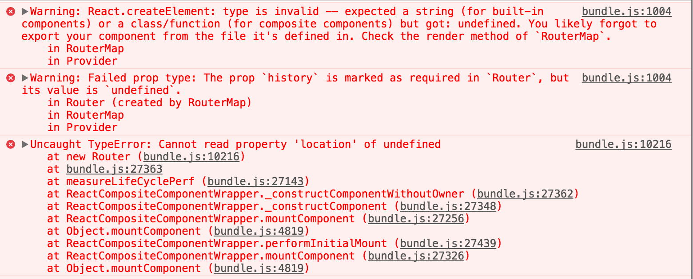

webpake 升级到2.0以后webpack.config.js配置变化，本项目使用的是webpack 2.6.1 
#开发中遇到的问题
##1.webpack 报错 No PostCSS Config found 解决方案
1).安装 npm install postcss-import autoprefixer cssnano style-loader postcss-loader --save-dev 
2).webpack.config.js配置

 	module: {
        loaders: [
            {
                test: /\.css$/,
                use: [
                    'style-loader',
                    {
                        loader: 'css-loader',
                        options: {importLoaders: 1} //这里可以简单理解为，如果css文件中有import 进来的文件也进行处理
                    },
                    {
                        loader: 'postcss-loader',
                        options: {           // 如果没有options这个选项将会报错 No PostCSS Config found
                            plugins: (loader) => [
                                require('postcss-import')({root: loader.resourcePath}),
                                require('autoprefixer')(), //CSS浏览器兼容
                                require('cssnano')()  //压缩css
                            ]
                        }
                    }
                ]
            }
        ]
    },
##2.react-router 报错

项目中的react-router 版本 4.1.1

1).react-router 升级 参考官网
https://reacttraining.com/react-router/web/api/Route/Route-render-methods

2).安装所必须要的包：

npm install --save-dev react-router

npm install --save-dev react-router-dom

3).基本引用：（原Router变为HashRouter，具体组件的配置 参数参考官网）

4).react-router 4.0 对于接受参数采用 { this.props.match.params.id }

如下例子：<Route path="list/:id"></Router> 
        <Link to="list/123456"></Link>

获取参数值的方式是：{ this.props.match.params.id }

 

